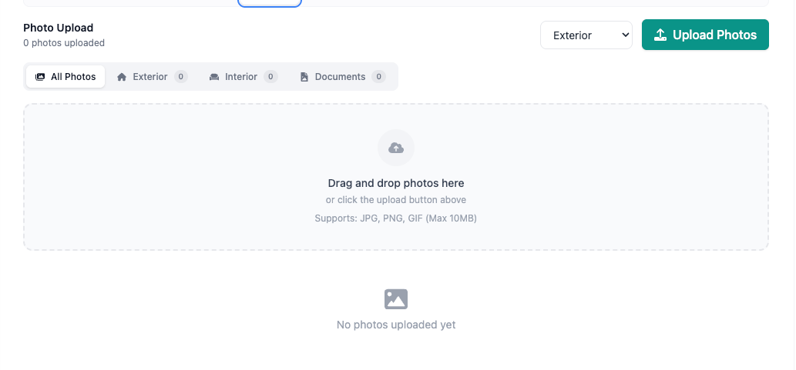
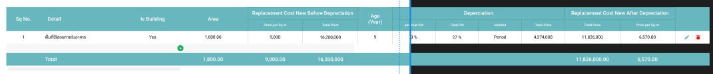
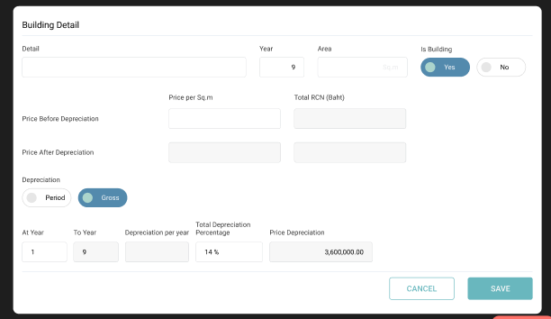
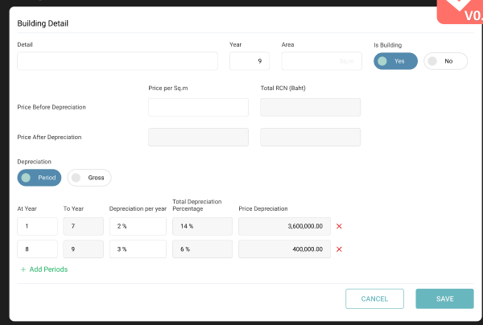

# Photo Gallery

When the appraiser goes to the site. they will keep take a photo and upload it into the gallery.
then, when the appraiser comes back to the office, they will go to collateral and upload a new photo or choose from a
gallery.
so the gallery is the appraisal application level and collateral is the colalteral level.

## Figma screen reference

you can refer to the Figma screen reference. and enhance it as needed.

### Gallery

- Gallery - Grid https://www.figma.com/design/CUkrOtlYAvpiuOO3jLKeuj/Collateral-Appraisal-System?node-id=3649-9491&m=dev
- Gallery -
  List https://www.figma.com/design/CUkrOtlYAvpiuOO3jLKeuj/Collateral-Appraisal-System?node-id=9425-37326&m=dev
- Gallery -
  Display https://www.figma.com/design/CUkrOtlYAvpiuOO3jLKeuj/Collateral-Appraisal-System?node-id=8944-19238&m=dev

### Photo

- I like ur design 
- User can select a photo from their device or
  gallery https://www.figma.com/design/CUkrOtlYAvpiuOO3jLKeuj/Collateral-Appraisal-System?node-id=3303-18506&m=dev
- User can also configure the photo layout to display in the appraisal report (1, 2, 3
  colums) https://www.figma.com/design/CUkrOtlYAvpiuOO3jLKeuj/Collateral-Appraisal-System?node-id=2367-15882&m=dev

# Document Checklist

This screen will show the document uploaded during request creation (upper part). and also provide the below part for
the appraiser to upload the other document e.g. Document, Appendix, Appraisal report. during upload, the appraiser can
choose to upload the file from device or choose from gallery.

## Figma screen reference

- https://www.figma.com/design/CUkrOtlYAvpiuOO3jLKeuj/Collateral-Appraisal-System?node-id=4893-22387&m=dev

# Building Detail Table

when depreciation is gross, user will key in only one percentage for the whole life of age 
if depreciation is preriod, user the percentage may vary based on period of year 

